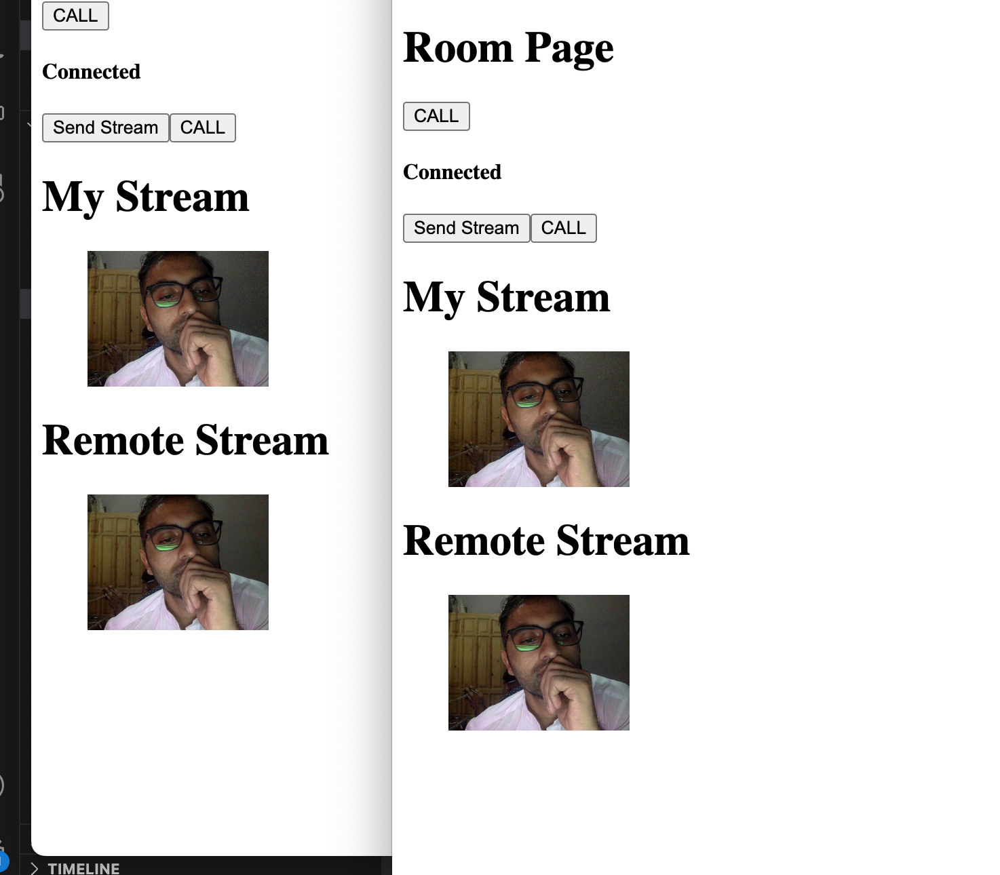

Project Name: WebRTC React Client and Node.js Server

Description:

This project is a WebRTC-based video conferencing application that combines a React.js client with a Node.js server, leveraging socket.io for real-time communication. Users can easily create and join video conferences, thanks to the power of WebRTC. The React.js client offers a dynamic and intuitive interface, with features such as React Player for multimedia playback and React Router for smooth navigation. With this application, real-time video conferencing has never been more accessible.

Key Features:

Real-time video conferencing with multiple participants.
Seamless integration of WebRTC technology for high-quality audio and video communication.
A user-friendly React.js client interface that includes React Player for multimedia support and React Router for smooth navigation.
The Node.js server handles signaling through socket.io, ensuring robust connections.
Getting Started:

To get started with this project, clone the repository, install the necessary dependencies, and follow the provided instructions for running both the server and client components.

Contributing:

We welcome contributions from the community to enhance and improve this project. If you're interested in contributing, please fork the repository, create a new branch, make your changes, and submit a pull request.

License:

This project is licensed under the MIT License. See the LICENSE file for more details.

Contact:

If you have any questions or need assistance, feel free to contact us at mabdullah.se@gmail.com

https://www.linkedin.com/in/mabdullahse/
